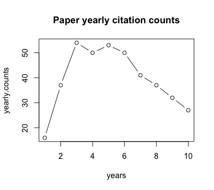
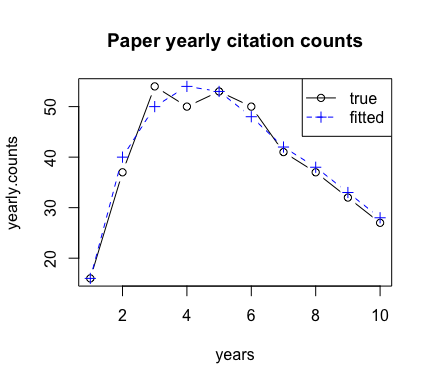

RPP
================

This is an R implementation of Reinforced Poisson Process model proposed in Wang, Song, and Barabasi (2013).


Reference
----------------------

Wang, D. S., C. M. Song, and A. L. Barabasi. 2013. “Quantifying Long-Term Scientific Impact.” JournalArticle.Science342 (6154): 127–32. doi:10.1126/science.1237825.3


Usage
================

Here is a brief description of how to use the functions provided in [rpp.R](https://github.com/pengminshi/RPP/blob/master/rpp.R) to fit a citation curve, following the model proposed in Wang, Song, and Barabasi (2013).

First source the **rpp.R** file

``` r
source('rpp.R')
```

Usage of main function
----------------------

The main function is `fitRPP(citation.times, ...)`, where `citation.times` is a vector {*t*<sub>*i*</sub>}<sub>*i* = 1</sub><sup>*n*</sup> of the time each citation is recieved by the paper, which is recorded by number of days after the paper was published.

For example, a paper X was published in 2000.01.01, then it received the first citation 50 days after publication, and the second citations arrived 75 days later, and so on. If the papers has received *n* citations until the give time *T* then `citation.times`=(50, 75, ...*t*<sub>*n*</sub>).

Input parameters:

-   `citation.times`: a vector indicating the arriving time of each citation {*t*<sub>*i*</sub>}<sub>*i* = 1</sub><sup>*n*</sup>
-   `m`: (optional) the global constant, suggested m = 30 by the science paper, as the defalt.
-   `time.T` (optional) the observation time \[0, *T*\], so that 0 ≤ *t*<sub>1</sub> ≤ *t*<sub>2</sub> ≤ … ≤ *t*<sub>*n*</sub> ≤ *T*. If not given, use the last citation arriving time as *T*, so that *T* = *t*<sub>*n*</sub>.
-   `verbose` (optional) boolean, whether to output esitmation at each step, by default is False.
-   `mu.init` (optional) the initial value of *μ*.
-   `sigma.init` (optional) the initial value of *σ*.
-   `max.iter` (optional) the maximum number of iteration in gradient descent, by default 1000.
-   `eps` (optional) tolerance using in stopping criteria, by default 10<sup>( − 8)</sup>.

Output:

A list containing the estimated parameters `mu`, `sigma`, `lambda` = $\\hat\\mu,\\hat\\sigma,\\hat\\lambda$ and `converge` shows whether the optimization converges before it reaches `max.iter` iterations.

``` r
fit = fitRPP(citation.times, m = 30, time.T = 10*365)
```

Example
-------

Here we generate citations of a paper following the model in Wang, Song, and Barabasi (2013). Given parameter (*λ*, *μ*, *σ*), the accumulative citation counts *c*(*t*) follows
*c*(*t*)=*m*(*e*<sup>*λ**F*(*t*; *μ*, *σ*)</sup> − 1)
 where *F*(*t*; *μ*, *σ*)=∫<sub>0</sub><sup>*t*</sup>*f*(*x*; *μ*, *σ*)*d**x* and *f*(*x*, *μ*, *σ*) is a log normal density function with mean *μ* sd *σ*, m is a global constant, suggested as 30 by the paper.

``` r
# generate the citation times of the paper, 
# that happen within 10 years (10 * 365 days)
time.T = 10 * 365
citation.time.example = citationGenerator(time.T = time.T , lambda = 3,
                                          mu = 7, sigma = 1, m = 30)
(n = length(citation.time.example)) # number of citations received in [0, time.T]
```

    ## [1] 397

Then add some noise

``` r
citation.time.example = citation.time.example + rnorm(n, 0,50)
citation.time.example[citation.time.example < 1] = 1
citation.time.example[citation.time.example > time.T ] = time.T 
citation.time.example = sort(citation.time.example, decreasing = F)
```

Count the yearly citations

``` r
# the function count the citations per year
yearly.counts = citationYearlyCount(citation.time.example)
plot(yearly.counts, type = 'b', xlab = 'years', 
     main = 'Paper yearly citation counts')
```



Then fit RPP model to estimate the parameters

``` r
fit = fitRPP(citation.time.example, time.T = 10 * 365)
fit
```

    ## $mu
    ## [1] 7.003895
    ## 
    ## $sigma
    ## [1] 1.041648
    ## 
    ## $lambda
    ## [1] 3.048524
    ## 
    ## $converge
    ## [1] TRUE

Plot the fitted curve on top of the yearly citations

``` r
fitted.citation = citationGenerator(time.T = 10 * 365, lambda = fit$lambda,
                                          mu = fit$mu, sigma = fit$sigma, m = 30)
fit.yearly.counts =  citationYearlyCount(fitted.citation)

plot(yearly.counts, type = 'b',col = 'black', xlab = 'years', 
     main = 'Paper yearly citation counts')
points(fit.yearly.counts, col = 'blue', lty = 2, type = 'b',pch = 3)
legend('topright', legend=c('true', 'fitted'), 
       col = c('black','blue'), lty = 1:2, pch = c(1,3))
```

 

# Reference

Wang, D. S., C. M. Song, and A. L. Barabasi. 2013. “Quantifying Long-Term Scientific Impact.” Journal Article. *Science* 342 (6154): 127–32. doi:[10.1126/science.1237825](https://doi.org/10.1126/science.1237825).
